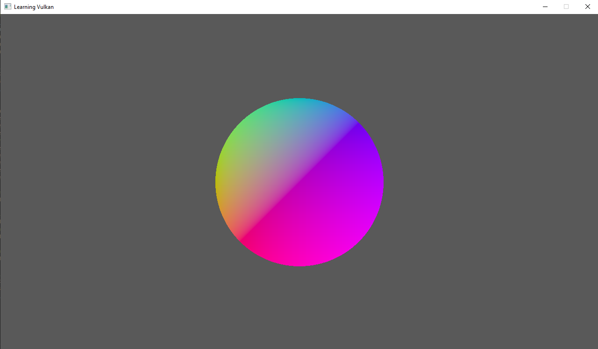

# Learning Vulkan

This repo is a means of documenting my journey with learning Vulkan's basics on windows. Because of the binaries in the LunarG VulkanSDK I decided to use the MSVC compiler. I used Build Tools 2017. 

If you want to see this thing working - make sure you have the `vulkan sdk` installed, and that you have added the directory in which your `vsdevcmd` lies to `PATH`.

It may still not work though!
This project was prepared around the VulkanSDK Version `1.2.189.2`, if your version is different (it most likely is, they come out basically every other day it seems), 
you should most likely reach into the [bs.json](bs.json) file and change `1.2.189.2` for the version you're using. ^^

To build everything and run:
`./compile_and_run`

Or:
`compole_and_run.cmd`

Expected results:
